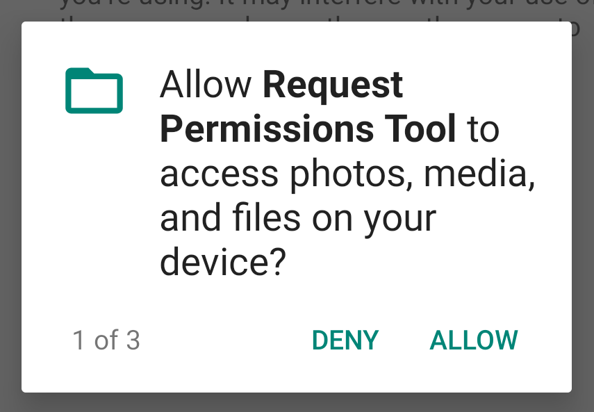
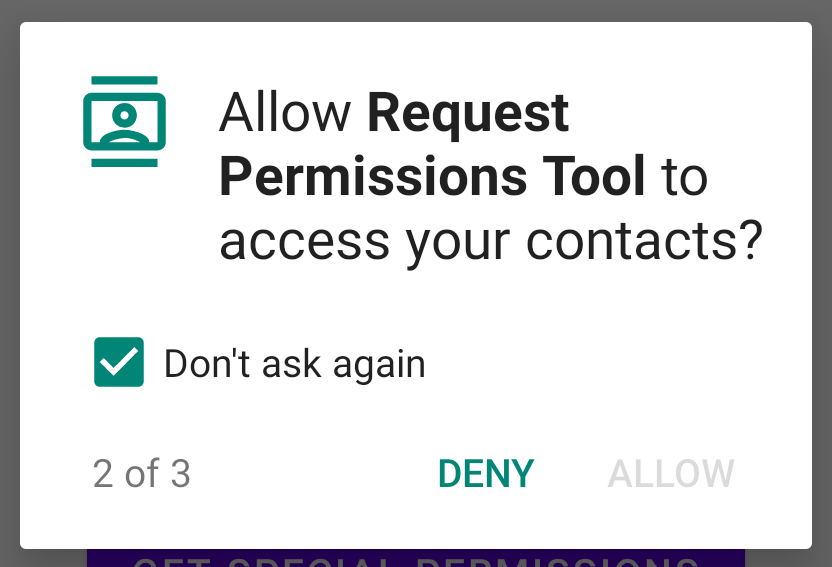
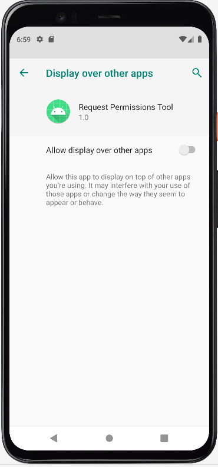

This Android application is a utility for working with app permissions.

App permissions help support user privacy by protecting access to restricted data and restricted actions (https://developer.android.com/guide/topics/permissions/overview). 
Android categorizes permissions into different types, including install-time permissions, runtime permissions, and special permissions. 

This app provides ```RuntimePermissionRequester``` class for handling requests with multiple runtime permissions and responses for them.





With ```RuntimePermissionRequester``` we can handling case when permission denied forever.





In this case we can go to app settings through ```Snackbar``` and set permission manually.


You can use ```GoingToSettingsSnackbar``` for this.


You can also use ```SpecialPermissionRequester``` to manage special permissions (https://developer.android.com/guide/topics/permissions/overview#special). 
For example, it can be permission for drawing window which will be shown on top of all other apps.





**Note**: You can handle the results of requests in an activity in any way you want, this ```MainActivity``` provides only a possible example of handling. 
You can find best practices [here](https://developer.android.com/guide/topics/permissions/overview#best-practices).
